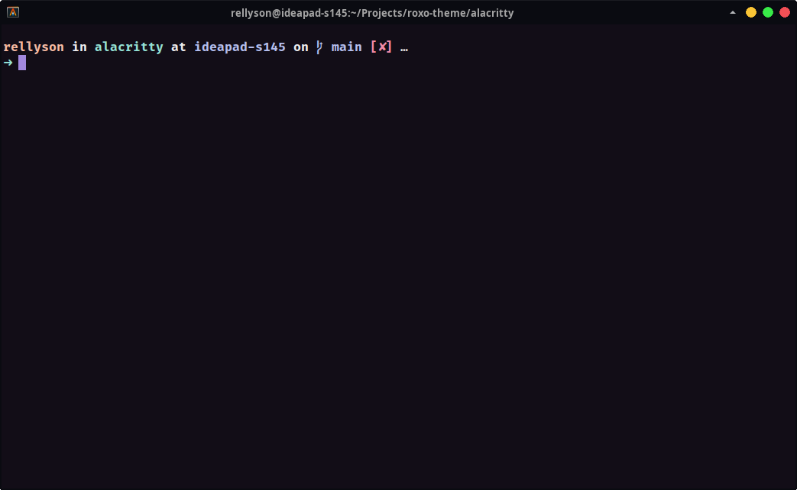

<div align="center">

# Roxo for Alacritty


[](https://opensource.org/licenses/MIT)



</div>

## Installation

- Get [colorscheme.yml](https://raw.githubusercontent.com/roxo-theme/alacritty/main/colorscheme.yml)
  and save it. e.g.`$HOME/.config/alacritty/roxo-colorscheme.yml`.
- Import it in your `alacritty.yml` config file:

  ```yaml
  import:
    - $HOME/.config/alacritty/roxo-colorscheme.yml
  # another configs...
  ```
